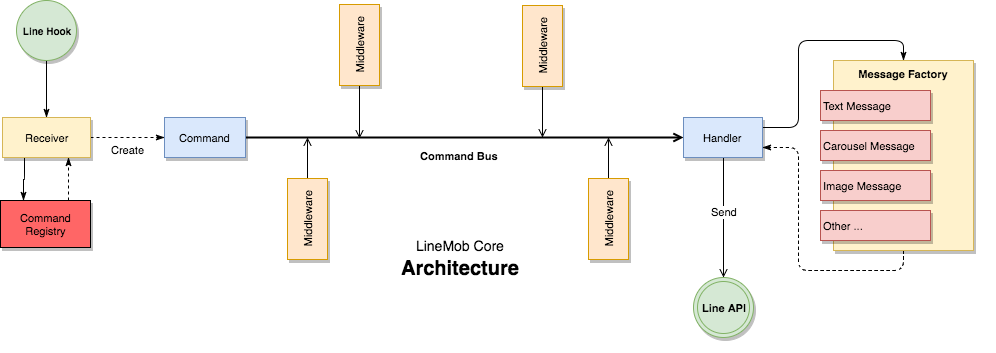

## สถาปัตยกรรม (Architecture)
LineMob Core ถูกออกแบบโดยใช้ Command/Query Pattern ซึ่งได้นำบางส่วนจากหลักการนี้มาใช้ ได้แก่ ส่วนของ Command 

## หลักการพื้นฐาน (Basic)
หลักการพื้นฐานของ LineMob Core ค่อนข้างง่ายและไม่ซับซ้อน ทำให้การพัฒนา Bot ไม่ได้เป็นเรื่องยากเกินไป เพียงแต่จะต้องทำความเข้าใจหลักการพื้นฐาน ดังต่อไปนี้

### Command
`Command` คือ ​Object ที่เก็บข้อมูล (Information) ต่างๆ โดยพื้นฐานแล้ว `Command` คือข้อมูลที่ประกอบใน คำสั่ง ที่ใช้บอกให้ `Handler` *(ดูคำอธิบายเพิ่มเติมในส่วนของ Handler)*  ทราบว่าต้องการให้ทำงานอะไร ซึ่งใน LineMob Core เราได้นำ Command มาใช้ โดยมีวัตถุประสงค์ 3 ประการ ดังต่อไปนี้

**1. ใช้เก็บสถานะ (State) ระหว่างการประมวลผลในระดับ Business Logic** คือในระหว่างที่ Command ถูกส่งไปยัง Handler จะสามารถเก็บสถานะใดๆ ไว้ระหว่างนั้นก็ได้ กระบวนการนี้จะเห็นภาพชัดเจนในหัวข้อของ `Middleware`

**2. ใช้เก็บคำสั่ง (Message) ที่ Handler ต้องการ** จากการที่ LINE ได้กำหนดไว้ว่าข้อมูล หรือ Message ที่ส่งไปยัง `LINE Messaging API` จะต้องเป็นข้อมูลที่ตรงตามมาตรฐานของ LINE (ดูรายละเอียดได้จาก LINE API Reference) ดังนั้น LineMob Core จึงได้สร้างชุด `Class Message Templates` ขึ้น เพื่อช่วยให้การสร้างข้อมูลหรือ Message ดังกล่าว สามารถทำได้ง่ายขึ้น

**3. ใช้เก็บ `Input` หรือ `Request Information`** ที่ได้รับจากผู้ใช้งานผ่านแอพพลิเคชั่น LINE
